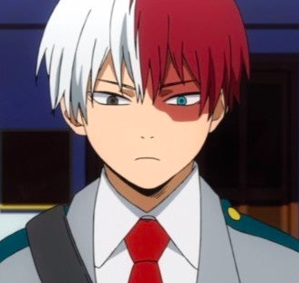

# BNHA Blog
## _September 23_
` Hello! So, I have recently started wathing anime. I am watching My Hero Acadmeia, it was suggested by my friend. Honeslty, the beginning of this season is kind of slow. Deku is just annoying me. Yes, he doesn;t have a quirk but that doesn;t mean he neds to let himself be pushed around by Bakugo. Also, his obsession with All Might is a little too much.`
## _September 24_
` Ok so this is picking up the pace now. Among the students that got into the academy, there are a couple that have caught my eye. Obviously Bakugo, becuase even though his personality isn't the best, he still has pretty good skills. He navigate his quirk well and is pretty smooth. Deku, obviously got in, becuase he is the main character. I like Ochaco's power, and I hope she does well. Todoroki looks fire and his power is pretty cool too. I sense his role is going to be a little bigger in the future. I am putting a picture becuase why not.`

## _September 26_
` Wow! I called it! Todoroki's backstory is worthy of a main character of a show! His power is so cool! When he used both his fire and his ice power at the sports competition, I was in love! Also, Deku was pretty cool when he was trying to make Shoto understand that rbelling against his father without using his fire was a stupid move. When he said, "It's your power isn't it?" I was going to cry. Both of them would really make a good team of heroes. Here is my favorite picture of Shoto.`

